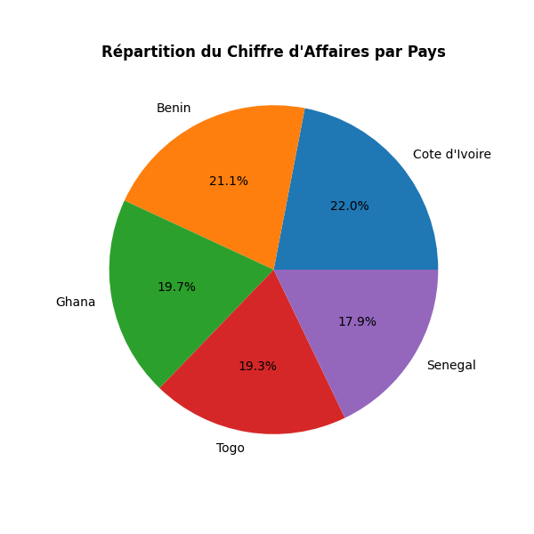
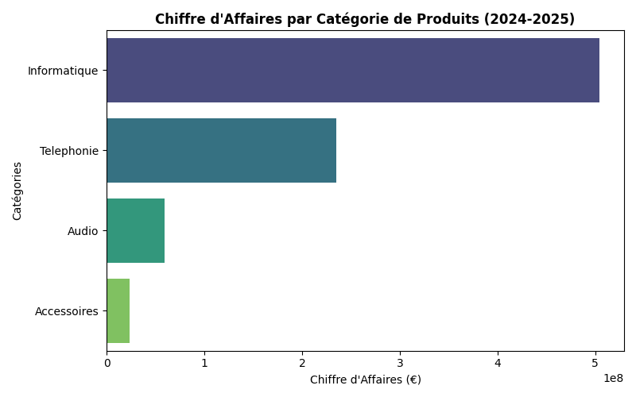

# Rapport d'analyse commerciale — AfriTech Distribution
**Client :** AfriTech Distribution (distribution informatique et électronique, Afrique de l'Ouest)
**Préparé par :** N'KOUEI N'tcha Gildas
**Date du rapport :** 15 Août 2026
**Objet :** Contrôle qualité des données de vente, analyse du chiffre d'affaires par pays/catégorie, comparaison réel vs objectif budgétaire, analyse de tendance mensuelle

---

## 1. Contexte et objectif

La direction commerciale a transmis l'historique des ventes 2024-2025 (863 transactions initiales, 5 pays d'implantation — Bénin, Togo, Côte d'Ivoire, Sénégal, Ghana), accompagné du catalogue produits et des objectifs budgétaires mensuels par pays. L'analyse répond à quatre objectifs :

1. Mettre à jour et fiabiliser les données transactionnelles (retrait d'un produit obsolète, référencement d'un nouveau produit, correction d'une erreur de saisie)
2. Établir la répartition du chiffre d'affaires par pays et par catégorie de produits
3. Comparer la performance réelle aux objectifs budgétaires fixés
4. Analyser la tendance mensuelle du chiffre d'affaires sur les deux exercices

---

## 2. Méthodologie

### 2.1 Mise à jour des données transactionnelles

Trois opérations de maintenance ont été appliquées à la base source avant analyse :
- Retrait des ventes du produit `Téléphone Basique` (référence supprimée du catalogue commercial)
- Référencement du nouveau produit `Webcam HD` (catégorie Accessoires)
- Correction d'une remise erronée appliquée sur l'ensemble des ventes du produit `Câble USB-C` (ramenée à 0 %)

⚠️ **Point de vigilance technique** : ces trois opérations ont été effectuées directement sur la base de données. Les données déjà chargées en mémoire avant ces corrections ne les reflètent pas automatiquement — un rechargement complet des tables après mutation a été nécessaire avant de lancer les calculs d'agrégation, afin d'éviter de travailler sur un instantané périmé.

### 2.2 Contrôle qualité — anomalie de calcul détectée et corrigée

Un premier calcul du chiffre d'affaires par catégorie, mené en parallèle en SQL et en Python pour validation croisée, a fait apparaître un écart entre les deux résultats. **Cause identifiée** : la requête SQL initiale divisait un taux de remise entier par un nombre entier (`remise_pct / 100`), ce qui déclenche en SQLite une **division entière** — le résultat est tronqué à 0 pour tous les taux de remise inférieurs à 100 %, annulant de fait l'effet de toute remise dans le calcul. La correction (`remise_pct / 100.0`, division décimale) a été appliquée à l'ensemble des requêtes concernées et validée par recoupement avec le calcul Python (qui, lui, effectue nativement une division décimale). Les deux méthodes convergent désormais au centime près.

### 2.3 Convention de calcul retenue

```
CA (par ligne de vente) = quantité × prix_unitaire × (1 − remise_pct / 100)
```
Devise de référence retenue pour ce rapport : **Euro (€)**, par convention de présentation (les données source ne précisent pas de devise).

---

## 3. Chiffre d'affaires par pays et par catégorie

| Pays | Chiffre d'affaires (€) |
|---|---|
| **Côte d'Ivoire** | **180 662 018** |
| Bénin | 173 838 741 |
| Ghana | 162 010 516 |
| Togo | 159 111 084 |
| Sénégal | 146 930 324 |
| **Total** | **822 552 683** |



Quatre des cinq pays dépassent le seuil de 150 millions d'euros de chiffre d'affaires (tous sauf le Sénégal, qui reste néanmoins proche du seuil). L'écart entre le premier (Côte d'Ivoire) et le dernier (Sénégal) reste contenu à 23 %, signe d'une activité commerciale relativement équilibrée entre les implantations.

| Catégorie | Chiffre d'affaires (€) | Part du total |
|---|---|---|
| **Informatique** | **504 324 948** | 61,3 % |
| Téléphonie | 235 412 323 | 28,6 % |
| Audio | 59 468 941 | 7,2 % |
| Accessoires | 23 346 471 | 2,8 % |



**Constat :** l'Informatique concentre à elle seule plus de 6 euros de chiffre d'affaires sur 10, ce qui en fait le principal moteur commercial de l'entreprise, loin devant les trois autres catégories réunies. Ce constat pondère la lecture du volume de transactions, plus élevé sur les Accessoires (produits à faible valeur unitaire) mais marginal en contribution au chiffre d'affaires global.

---

## 4. Analyse budgétaire — réel vs objectif

### 4.1 Constat initial

Le rapprochement entre le chiffre d'affaires réel mensuel et l'objectif budgétaire fixé par pays fait apparaître des valeurs manquantes (`NaN`) pour le Ghana sur plusieurs mois.

### 4.2 Vérification avant conclusion

Avant de conclure à un défaut de suivi budgétaire, l'origine des valeurs manquantes a été investiguée : **aucun objectif n'a été fixé pour le Ghana avant juillet 2024** (absence structurelle dans la table des objectifs, et non une erreur de saisie ou une perte de donnée). Ces 6 mois représentent **26,1 % du chiffre d'affaires total généré par le Ghana** sur la période — une part trop importante pour être ignorée du reporting, mais qui ne doit pas être interprétée comme un écart de performance, faute de référence budgétaire disponible.

**Conclusion :** le calcul d'écart budgétaire pour le Ghana doit être lu uniquement à partir de juillet 2024 ; toute moyenne d'écart calculée sur l'ensemble de la période pour ce pays serait faussée par les valeurs manquantes.

### 4.3 Recommandation opérationnelle

Fixer rétroactivement, ou à défaut signaler explicitement dans les tableaux de bord, l'absence d'objectif Ghana sur le premier semestre 2024, pour éviter toute mauvaise lecture par les équipes commerciales locales.

---

## 5. Évolution mensuelle du chiffre d'affaires

| Mois | CA (€) | Variation vs mois précédent |
|---|---|---|
| Janvier 2024 | 32 354 887 | — |
| Février 2024 | 30 681 764 | -5,2 % |
| Mars 2024 | 24 033 112 | -21,7 % |
| Avril 2024 | 31 897 806 | +32,7 % |
| Mai 2024 | 36 087 726 | +13,1 % |
| Juin 2024 | 15 403 310 | -57,3 % |
| *(série complète en annexe Excel — feuille "Evolution mensuelle CA")* | | |

**Constat :** le chiffre d'affaires mensuel présente une forte volatilité brute (variations mensuelles pouvant dépasser ±50 %), cohérente avec un volume de transactions individuellement significatif sur un nombre de ventes encore modéré par mois. La moyenne mobile sur 3 mois (courbe en pointillé) lisse cette volatilité et ne fait apparaître aucune tendance de croissance ou de décroissance structurelle nette sur les deux exercices — l'activité oscille autour d'un palier stable plutôt qu'elle ne progresse ou ne régresse.

---

## 6. Classement des pays et répartition des ventes par taille

| Tranche de vente | Nombre de transactions |
|---|---|
| Grosse vente (≥ 500 000 €) | 365 |
| Vente moyenne (100 000 – 500 000 €) | 248 |
| Petite vente (< 100 000 €) | 193 |

**Constat :** 45 % des transactions sont classées "grosse vente" — cohérent avec le poids de la catégorie Informatique (produits à forte valeur unitaire) dans le chiffre d'affaires global.

---

## 7. Produits au-dessus du prix catalogue moyen

Le prix de vente catalogue moyen, recalculé après l'ajout du produit `Webcam HD`, s'établit à **147 375 €**. Cinq produits dépassent ce seuil :

| Produit | Prix catalogue (€) | CA généré (€) |
|---|---|---|
| Ordinateur Portable Pro | 750 000 | 249 422 100 |
| Smartphone Premium | 420 000 | 159 898 800 |
| Ordinateur Portable Essentiel | 380 000 | 131 242 700 |
| Smartphone Essentiel | 150 000 | 75 513 540 |
| Tablette 10 pouces | 220 000 | 72 292 150 |

**Constat :** ces 5 produits "premium" (sur 15 référencés), bien que minoritaires en nombre, génèrent à eux seuls **688 369 290 €**, soit **83,7 % du chiffre d'affaires total** — une forte concentration de la valeur sur un nombre restreint de références, à surveiller en cas de rupture de stock ou de fin de vie produit sur l'un d'entre eux.

⚠️ *Note méthodologique : l'ajout du produit Webcam HD (prix bas) a mécaniquement abaissé la moyenne catalogue, faisant entrer le Smartphone Essentiel dans ce classement alors qu'il en était exclu avant cet ajout — point à garder en tête si ce calcul est reproduit après une nouvelle mise à jour du catalogue.*

---

## 8. Recommandations

1. **Sécuriser la donnée budgétaire du Ghana** sur le premier semestre 2024 (objectif manquant), pour fiabiliser tout reporting d'écart consolidé multi-pays.
2. **Surveiller la concentration du chiffre d'affaires** sur les 5 produits premium (83,7 % du total) — évaluer un plan de mitigation du risque de rupture sur ces références.
3. **Ne pas piloter sur le CA brut mensuel** compte tenu de sa forte volatilité ; privilégier la moyenne mobile 3 mois pour toute lecture de tendance à la direction.
4. **Revalider systématiquement toute requête SQL impliquant une division** entre deux colonnes numériques entières, suite à l'anomalie de division entière détectée et corrigée dans ce rapport.

---

## 9. Limites de l'analyse

- La devise de référence (€) est une convention de présentation, non confirmée par les données source.
- L'écart budgétaire du Ghana ne peut être évalué sur l'ensemble de la période étudiée, faute d'objectif fixé avant juillet 2024.
- Le classement "produits premium" (section 7) dépend du catalogue au moment du calcul ; l'ajout ou le retrait d'une référence modifie le seuil moyen et peut faire entrer ou sortir des produits du classement, comme démontré avec le Webcam HD.
- Aucune analyse de marge (à partir du prix d'achat) n'a été menée dans ce rapport, qui se concentre sur le chiffre d'affaires ; une analyse de rentabilité par produit/pays constituerait un prolongement naturel.

---

## Annexe — Code Python utilisé

```python
import sqlite3
from pathlib import Path
import pandas as pd
import matplotlib.pyplot as plt
import seaborn as sns

# ── 1. Connexion et corrections de donnees (A) ──────────────────────────────
DB_PATH = "./data/afritech_distribution_v2.db"
OUT = "./outputs"
Path(OUT).mkdir(parents=True, exist_ok=True)

connexion = sqlite3.connect(DB_PATH)

connexion.execute("DELETE FROM ventes WHERE produit_id = 7")
connexion.execute(
    "INSERT INTO produits(produit_id, nom_produit, categorie, prix_vente_base, prix_achat) "
    "VALUES (16, 'Webcam HD', 'Accessoires', 22000, 12000)"
)
connexion.execute("UPDATE ventes SET remise_pct = 0 WHERE produit_id = 14")
connexion.commit()

# Rechargement APRÈS corrections : indispensable pour travailler sur des données à jour
ventes = pd.read_sql_query("SELECT * FROM ventes", connexion)
produits = pd.read_sql_query("SELECT * FROM produits", connexion)
objectifs = pd.read_sql_query("SELECT * FROM objectifs_mensuels", connexion)

ventes["date_vente"] = pd.to_datetime(ventes["date_vente"])
ventes["mois"] = ventes["date_vente"].dt.strftime("%Y-%m")
ventes["CA"] = ventes["quantite"] * ventes["prix_unitaire"] * (1 - ventes["remise_pct"] / 100)

# ── 2. CA par pays et par catégorie (division corrigée : /100.0 en SQL) ──
ca_pays = ventes.groupby("pays")["CA"].sum().sort_values(ascending=False)

ventes_cat = ventes.merge(produits, on="produit_id", how="left")
ca_categorie = ventes_cat.groupby("categorie")["CA"].sum().sort_values(ascending=False)

requete_categorie = """
SELECT p.categorie, SUM((v.quantite * v.prix_unitaire) * (1 - v.remise_pct / 100.0)) AS CA
FROM ventes v
LEFT JOIN produits p ON v.produit_id = p.produit_id
GROUP BY p.categorie
ORDER BY CA DESC
"""
ca_categorie_sql = pd.read_sql_query(requete_categorie, connexion)

requete_top_pays = """
SELECT pays, SUM((quantite * prix_unitaire) * (1 - remise_pct / 100.0)) AS CA
FROM ventes GROUP BY pays HAVING CA > 150000000 ORDER BY CA DESC
"""
top_pays = pd.read_sql_query(requete_top_pays, connexion)

# ── 3. Classification des ventes par tranche ─────────────────────────────
requete_classement = """
WITH ventes_calc AS (
    SELECT id_vente, (quantite * prix_unitaire) * (1 - remise_pct / 100.0) AS CA
    FROM ventes
)
SELECT id_vente, CA,
    CASE WHEN CA < 100000 THEN 'Petite vente'
         WHEN CA < 500000 THEN 'Vente moyenne'
         ELSE 'Grosse vente' END AS classement_CA
FROM ventes_calc
"""
classement = pd.read_sql_query(requete_classement, connexion)
repartition_tranches = classement["classement_CA"].value_counts()

# ── 4. Sous-requête corrigée : produits au-dessus du prix catalogue moyen ─
requete_produits_top = """
SELECT nom_produit, prix_vente_base
FROM produits
WHERE prix_vente_base > (SELECT AVG(prix_vente_base) FROM produits)
ORDER BY prix_vente_base DESC
"""
produits_top = pd.read_sql_query(requete_produits_top, connexion)

ca_produits_top = (
    ventes_cat[ventes_cat["nom_produit"].isin(produits_top["nom_produit"])]
    .groupby("nom_produit")["CA"].sum()
    .sort_values(ascending=False)
)

# ── 5. Écart budgétaire réel vs objectif ──────────────────────────────────
ca_mensuel_pays = ventes.groupby(["pays", "mois"])["CA"].sum().reset_index()
ecart_budget = ca_mensuel_pays.merge(objectifs, on=["pays", "mois"], how="left")
ecart_budget["ecart_pct"] = ecart_budget["CA"] / ecart_budget["objectif_ca"]

ghana_sans_objectif = ecart_budget[
    (ecart_budget["pays"] == "Ghana") & (ecart_budget["objectif_ca"].isna())
]
part_ca_ghana_sans_objectif = (
    ghana_sans_objectif["CA"].sum()
    / ecart_budget[ecart_budget["pays"] == "Ghana"]["CA"].sum()
)

# ── 6. Fonctions de fenêtrage — évolution mensuelle ───────────────────────
requete_variation = """
WITH calcul AS (
    SELECT STRFTIME('%Y-%m', date_vente) AS mois,
           SUM((quantite * prix_unitaire) * (1 - remise_pct / 100.0)) AS ca_total
    FROM ventes GROUP BY mois
)
SELECT mois, ca_total,
    LAG(ca_total, 1) OVER (ORDER BY mois) AS ca_precedent,
    ca_total - LAG(ca_total, 1) OVER (ORDER BY mois) AS variation_absolue,
    ROUND((ca_total - LAG(ca_total,1) OVER (ORDER BY mois)) * 100.0
          / NULLIF(LAG(ca_total,1) OVER (ORDER BY mois), 0), 2) AS variation_pct,
    SUM(ca_total) OVER (ORDER BY mois ROWS BETWEEN UNBOUNDED PRECEDING AND CURRENT ROW) AS ca_cumule,
    ROUND(AVG(ca_total) OVER (ORDER BY mois ROWS BETWEEN 2 PRECEDING AND CURRENT ROW), 2) AS moyenne_mobile_3m
FROM calcul ORDER BY mois
"""
evolution_mensuelle = pd.read_sql_query(requete_variation, connexion)

requete_rang = """
WITH calcul AS (
    SELECT pays, SUM((quantite * prix_unitaire) * (1 - remise_pct / 100.0)) AS ca_total
    FROM ventes GROUP BY pays
)
SELECT pays, ca_total, RANK() OVER (ORDER BY ca_total DESC) AS rang
FROM calcul ORDER BY ca_total DESC
"""
rang_pays = pd.read_sql_query(requete_rang, connexion)

connexion.close()
```

*(Script complet avec génération des graphiques et export Excel : voir `analyse_afritech.py` en pièce jointe.)*
