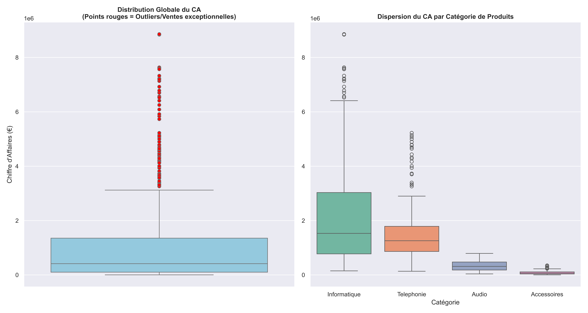
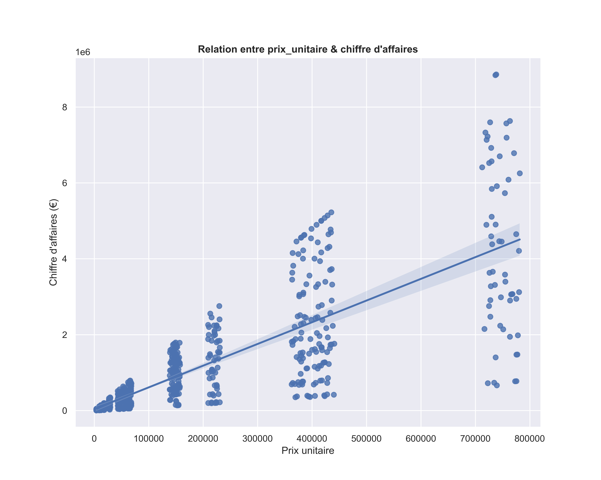

# Rapport d'analyse statistique — AfriTech Distribution
**Client :** AfriTech Distribution
**Préparé par :** N'KOUEI N'tcha Gildas
**Date du rapport :** 12 Août 2026
**Objet :** Revue statistique des ventes 2024-2025 — tendance centrale, volatilité, détection d'anomalies, identification des drivers de performance

---

## 1. Contexte et objectif

Dans la continuité de l'analyse commerciale déjà livrée, la direction financière souhaite une **revue statistique** de la base de ventes (806 transactions, 2024-2025, données déjà corrigées) : identifier si les données recèlent des anomalies avant la clôture de l'exercice, évaluer la stabilité de l'activité par pays et par catégorie, et déterminer objectivement quels facteurs pilotent réellement le chiffre d'affaires.

## 2. Convention de calcul

```
CA (par ligne de vente) = quantité × prix_unitaire × (1 − remise_pct / 100)
```
Devise de référence : Euro (€), par convention de présentation.

---

## 3. Tendance centrale — le CA "typique" est-il fiable ?

| Indicateur | Valeur |
|---|---|
| CA total | 822 552 683 € |
| CA moyen (par transaction) | 1 020 537 € |
| CA médian (par transaction) | 414 468 € |
| Écart moyenne / médiane | +146 % |

**Constat :** la moyenne représente plus du double de la médiane — un écart qui ne s'explique pas par une "instabilité générale" des ventes, mais par la présence d'un nombre restreint de transactions à très forte valeur qui tirent la moyenne vers le haut (cf. section 5). **La médiane (414 468 €) est la mesure la plus représentative** d'une transaction courante chez AfriTech ; la moyenne seule donnerait une image trompeuse de l'activité "typique".

### Tendance centrale par pays

| Pays | CA moyen | CA médian | Écart |
|---|---|---|---|
| Togo | 1 067 860 € | 517 625 € | +106 % |
| Bénin | 1 004 848 € | 387 264 € | +159 % |
| Ghana | 958 642 € | 386 740 € | +148 % |
| Sénégal | 986 110 € | 385 588 € | +156 % |
| **Côte d'Ivoire** | 1 088 325 € | 401 781 € | **+171 %** |

**Constat :** l'écart moyenne/médiane est présent dans les 5 pays (aucun n'est parfaitement homogène), mais avec une intensité variable — le **Togo** présente l'écart le plus faible (transactions plus régulières), la **Côte d'Ivoire** l'écart le plus élevé (présence plus marquée de grosses transactions ponctuelles).

---

## 4. Volatilité — l'activité est-elle stable ou risquée ?

| Périmètre | Écart-type du CA |
|---|---|
| Global | 1 480 318 € |
| Informatique | 1 910 921 € |
| Téléphonie | 1 291 282 € |
| Audio | 193 725 € |
| Accessoires | 74 975 € |

**Constat :** un écart-type global (1,48 M€) supérieur au CA médian (414 468 €) confirme une **dispersion extrême** des montants de vente. Le classement par catégorie suit une logique cohérente avec le niveau de prix unitaire : **Informatique** (produits les plus chers) est la catégorie la plus volatile, **Accessoires** (produits à faible valeur unitaire) la plus stable et la plus prévisible.

**Hypothèse à valider ultérieurement** : cette hiérarchie de volatilité semble directement liée au niveau de prix unitaire plutôt qu'à un facteur de risque commercial propre à chaque catégorie — une décomposition des drivers (volume/prix/remise) permettrait de confirmer ou nuancer ce lien.

---

## 5. Détection d'anomalies — IQR et outliers

| Indicateur | Valeur |
|---|---|
| Q1 | 102 780 € |
| Q3 | 1 353 635 € |
| IQR | 1 250 855 € |
| Seuil bas | -1 773 503 € |
| Seuil haut | 3 229 918 € |
| Transactions détectées comme outliers | 72 (sur 806) |
| Part du CA total générée par ces transactions | **43,6 %** |



**Constat n°1** : le seuil bas étant négatif, aucune transaction ne peut structurellement être détectée comme outlier bas — cohérent avec l'absence de retours/remboursements dans le périmètre analysé, sans qu'aucune règle de filtrage manuelle n'ait été nécessaire.

**Constat n°2 — nuance méthodologique importante** : que 72 transactions (9 % du volume) génèrent 43,6 % du CA total ne doit **pas** être lu comme "près de la moitié du chiffre d'affaires est anormale". Le CA étant une donnée structurellement asymétrique (jamais négative, avec des transactions à forte valeur possibles), la méthode IQR — conçue pour des distributions à peu près symétriques — tend à sur-détecter des outliers sur ce type de donnée. Ce résultat reflète plus probablement une **concentration normale de l'activité** (effet Pareto, courant en distribution B2B) qu'une anomalie généralisée à corriger.

**Lecture par catégorie (graphique de droite)** :
- **Audio** : aucun outlier détecté — catégorie sans ventes exceptionnelles.
- **Téléphonie** : quelques outliers, tendance centrale stable.
- **Accessoires** : outliers présents avec une asymétrie vers le bas (quelques transactions à CA anormalement faible plutôt qu'élevé).
- **Informatique** : la catégorie la plus dispersée, avec les outliers les plus marqués — cohérent avec son statut de catégorie la plus volatile (section 4).

**Recommandation** : ne pas traiter ces 72 transactions comme un bloc homogène à corriger, mais les passer en revue individuellement (client, produit, date) pour distinguer les grosses ventes légitimes des éventuelles erreurs de saisie.

---

## 6. Drivers de performance — qu'est-ce qui explique réellement le chiffre d'affaires ?

| Relation testée | Corrélation (global) | Force |
|---|---|---|
| Quantité vendue ↔ CA | 0,33 | Faible à modérée |
| Prix unitaire ↔ CA | 0,81 | Très forte |



**Constat global** : le chiffre d'affaires d'AfriTech est piloté en priorité par **l'effet prix** (l'effet volume seul explique beaucoup moins la variation du CA). Le nuage de points fait apparaître une structure en paliers de prix distincts (le catalogue se répartit sur des niveaux de prix nets, de 4 000 € à 750 000 €), avec les produits les plus chers générant systématiquement les transactions les plus importantes.

### Analyse plus fine par catégorie — un résultat qui nuance la conclusion globale

| Catégorie | Corrélation Quantité/CA | Corrélation Prix/CA |
|---|---|---|
| Audio | **0,94** | 0,23 |
| Téléphonie | 0,65 | 0,57 |
| Accessoires | 0,59 | 0,72 |
| Informatique | 0,57 | 0,67 |

**Constat majeur** : une fois la corrélation recalculée **à l'intérieur de chaque catégorie**, l'effet volume redevient nettement plus fort qu'au niveau global (jusqu'à 0,94 sur l'Audio, contre 0,33 tous produits confondus). Ce contraste s'explique par un effet statistique classique : au niveau agrégé, l'énorme dispersion de prix **entre catégories** (de 4 000 à 750 000 €) domine la variance totale et masque l'effet réel du volume, qui redevient visible une fois cette variable de confusion neutralisée.

**Conclusion nuancée** : le CA global est bien piloté principalement par l'effet prix (catalogue très étagé), mais **au sein d'une même catégorie de produits**, le volume vendu reste un driver significatif de la performance — particulièrement marqué sur l'Audio. Une décomposition complète des drivers (volume, prix, remise, coûts) permettra de quantifier précisément la part de chaque effet dans la variation du profit — objet de la prochaine étape de l'analyse.

---

## 7. Recommandations

1. **Piloter sur la médiane, pas la moyenne**, pour toute communication sur "le CA typique" d'une transaction — la moyenne surestime largement l'activité courante.
2. **Ne pas traiter les 72 transactions "outliers" comme un bloc anormal** : les passer en revue individuellement avant toute décision (correction comptable, alerte fraude, etc.).
3. **Approfondir la relation volume/CA par catégorie**, en particulier sur l'Audio, où le volume semble un vrai levier de croissance sous-estimé par la lecture globale.
4. **Poursuivre avec une décomposition des drivers** (volume/prix/remise/COGS) pour quantifier précisément l'origine de la variation du profit, plutôt que de s'arrêter à des corrélations.

## 8. Limites de l'analyse

- La devise de référence (€) est une convention de présentation, non confirmée par les données source.
- La méthode IQR appliquée à une donnée financière structurellement asymétrique tend à sur-détecter des outliers ; le seuil de 43,6 % du CA doit être interprété avec prudence, pas comme une alerte automatique.
- Les corrélations mesurées (globales et sectorielles) ne permettent pas d'isoler un effet "toutes choses égales par ailleurs" — seule une décomposition de variance (étape suivante) permettra de quantifier séparément la contribution du volume, du prix et de la remise à la variation du profit.
- Aucune donnée de coût (COGS) n'a été mobilisée dans ce rapport, centré sur le chiffre d'affaires.

---

## Annexe — Code Python utilisé

```python
import sqlite3
from pathlib import Path
import pandas as pd
import matplotlib.pyplot as plt
import seaborn as sns

# ── Accès aux data ─────────────────────────────────────────────
DB_PATH = "./data/afritech_distribution_v2.db"  
OUT = "./outputs" 
Path(OUT).mkdir(parents=True, exist_ok=True) 

connexion = sqlite3.connect(DB_PATH)

ventes = pd.read_sql_query("SELECT * FROM ventes", connexion)
produits = pd.read_sql_query("SELECT * FROM produits", connexion)
connexion.close()

ventes["date_vente"] = pd.to_datetime(ventes["date_vente"])
ventes["mois"] = ventes["date_vente"].dt.strftime("%Y-%m")
ventes["ca"] = ventes["quantite"] * ventes["prix_unitaire"] * (1 - ventes["remise_pct"] / 100.0)
ventes_produits = ventes.merge(produits, on="produit_id", how="left")

# ── A. Tendance centrale ──────────────────────────────────────────────
ca_total = ventes["ca"].sum()
ca_pays = ventes.groupby("pays")["ca"].sum()
ca_moyen = ventes["ca"].mean()
ca_median = ventes["ca"].median()

stats_pays = ventes.groupby("pays")["ca"].agg(["mean", "median"])
stats_pays["ecart_pct"] = (stats_pays["mean"] - stats_pays["median"]) / stats_pays["median"]

# ── B. Volatilité ──────────────────────────────────────────────────────
std_global = ventes["ca"].std()
std_categorie = ventes_produits.groupby("categorie")["ca"].std().sort_values(ascending=False)

# ── C. Détection d'anomalies ──────────────────────────────────────────
Q1 = ventes["ca"].quantile(0.25)
Q3 = ventes["ca"].quantile(0.75)
IQR = Q3 - Q1
seuil_bas = Q1 - 1.5 * IQR
seuil_haut = Q3 + 1.5 * IQR

outliers = ventes[(ventes["ca"] < seuil_bas) | (ventes["ca"] > seuil_haut)]
proportion_outliers = outliers["ca"].sum() / ventes["ca"].sum()

# ── D. Corrélations / drivers ──────────────────────────────────────────
qte_ca = ventes["quantite"].corr(ventes["ca"])
prix_ca = ventes["prix_unitaire"].corr(ventes["ca"])

corr_cat_qte = ventes_produits.groupby("categorie").apply(
    lambda y: y["quantite"].corr(y["ca"]), include_groups=False
)
corr_cat_prix = ventes_produits.groupby("categorie").apply(
    lambda y: y["prix_unitaire"].corr(y["ca"]), include_groups=False
)

# ── Graphiques ───────────────────────────────────────────────────────────
sns.set_theme(style="darkgrid")

plt.figure(figsize=(15, 8))
plt.subplot(1, 2, 1)
sns.boxplot(y=ventes["ca"], color="skyblue", flierprops={"markerfacecolor": "red", "marker": "o"})
plt.title("Distribution globale du CA\n(points rouges = outliers)", fontweight="bold")
plt.ylabel("Chiffre d'affaires (EUR)")

plt.subplot(1, 2, 2)
ordre_categories = ventes_produits.groupby("categorie")["ca"].median().sort_values(ascending=False).index
sns.boxplot(x="categorie", y="ca", data=ventes_produits, order=ordre_categories, hue="categorie", palette="Set2", legend=False)
plt.title("Dispersion du CA par catégorie", fontweight="bold")
plt.tight_layout()
plt.savefig("dispersion_ca.png", dpi=200)
plt.close()

plt.figure(figsize=(9, 6))
sns.regplot(x="prix_unitaire", y="ca", data=ventes, scatter_kws={"alpha": 0.5})
plt.title("Relation entre prix unitaire et chiffre d'affaires", fontweight="bold")
plt.tight_layout()
plt.savefig("correlation_prix_ca.png", dpi=200)
plt.close()
```

*(Script complet avec export Excel : voir `analyse_stats_afritech.py` en pièce jointe.)*
