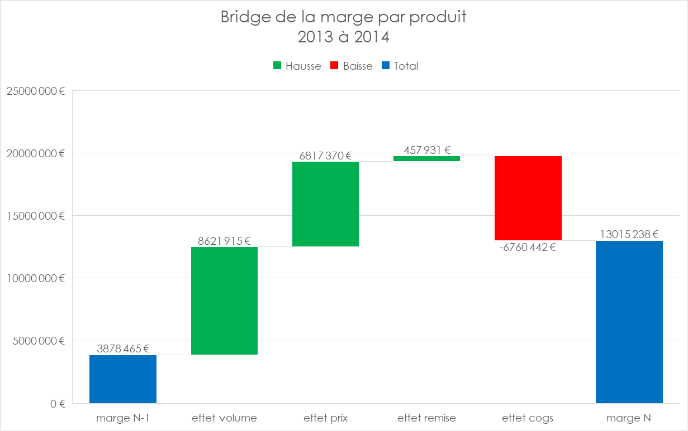
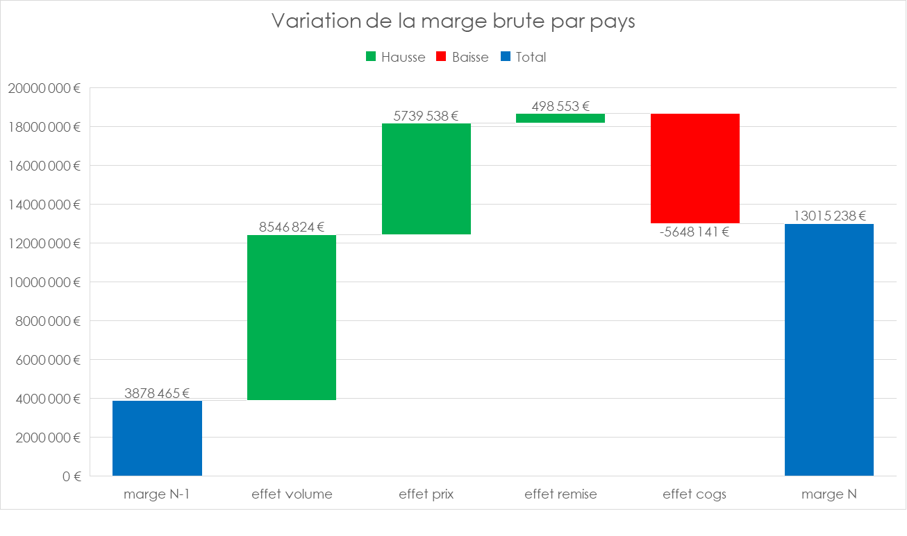

# Rapport d'Analyse de la Performance Commerciale
**À l'attention :** Direction Générale et Direction Financière
**Objet :** Explication de la variation de la marge brute par les leviers Volume, Prix, Remise et Coûts (Bridge Analysis)
**Axes d'analyse :** Ligne de Produit (6 références) et Marché géographique (5 pays)
**Période analysée :** Exercice 2013 vs Exercice 2014
**Statut :** Version vérifiée et réconciliée

---

## 1. Contexte et objectif

La marge brute a fortement progressé entre 2013 et 2014. Avant de communiquer ce résultat comme une simple bonne nouvelle, l'objectif de cette analyse est de comprendre **d'où vient réellement cette progression** : est-elle portée par les volumes vendus, par les prix pratiqués, par la politique de remise commerciale, ou par l'évolution des coûts d'achat/production ? Une progression de marge peut cacher des dynamiques très différentes — certaines saines et reproductibles, d'autres ponctuelles ou fragiles.

**Constat global** : la marge brute est passée de **3 878 465 €** à **13 015 238 €**, soit **+9 136 773 € (+235,6 %)**.

**Deux points à vérifier avant d'aller plus loin dans le pilotage** :
- **Remises** : les taux utilisés sont des moyennes par ligne — une revue détaillée par client permettrait de distinguer une politique commerciale volontaire (avantages fidélité, fin d'année) d'une dégradation tarifaire défensive imposée par la concurrence.
- **Coûts (COGS)** : certaines lignes affichent des variations de coût unitaire très marquées — à confirmer avec les équipes achats/production (nouveau fournisseur, effet devise, changement de méthode de valorisation des stocks).

---

## 2. Méthode utilisée

Décomposition séquentielle de la variation de marge (méthode de substitution en chaîne), calculée **ligne par ligne** (par produit, puis par pays) avant d'être consolidée — jamais sur une moyenne globale, pour éviter qu'un effet de mix (produits/pays à prix très différents) ne fausse la lecture. Ordre retenu : **Volume → Prix → Remise → COGS**.

```
Effet Volume = (Q2014 − Q2013) × [P2013 × (1 − R2013) − C2013]
Effet Prix   = Q2014 × (1 − R2013) × (P2014 − P2013)
Effet Remise = Q2014 × P2014 × (R2013 − R2014)
Effet COGS   = Q2014 × (C2013 − C2014)
```

*Convention retenue : la remise déjà en vigueur en 2013 est intégrée dès l'effet Volume et l'effet Prix, pour ne pas la compter deux fois.*

**Contrôle appliqué à chaque ligne** : Marge 2013 + les 4 effets doit toujours retomber exactement sur la Marge 2014. Si ce n'est pas le cas, on ne cherche pas à "arrondir" — on cherche l'erreur avant de publier un seul chiffre.

---

## 3. Résultats du pont de marge

### 3.1 Par Ligne de Produit (en €)

| Ligne de Produit | Effet Volume | Effet Prix | Effet Remise | Effet COGS | Marge 2013 | Marge 2014 | Variation |
|---|---|---|---|---|---|---|---|
| Amarilla | 2 041 197 | 1 839 440 | -316 916 | -2 313 516 | 781 950 | 2 032 155 | +1 250 205 |
| Carretera | 103 747 | 6 926 237 | 310 526 | -5 591 242 | 38 769 | 1 788 036 | +1 749 267 |
| Montana | 1 030 057 | -1 279 915 | -227 238 | 1 676 335 | 457 758 | 1 656 997 | +1 199 239 |
| Paseo | 2 323 422 | 8 350 519 | 336 320 | -8 412 530 | 1 099 853 | 3 697 585 | +2 597 732 |
| Velo | 1 315 445 | -7 453 668 | 201 630 | 6 998 687 | 621 950 | 1 684 043 | +1 062 093 |
| VTT | 1 808 047 | -1 565 242 | 153 609 | 881 824 | 878 185 | 2 156 423 | +1 278 238 |
| **TOTAL** | **8 621 915** | **6 817 370** | **457 931** | **-6 760 442** | **3 878 465** | **13 015 238** | **+9 136 773** |

*Contrôle vérifié à 0 sur chaque ligne et sur le total.*



### 3.2 Par Marché géographique (en €)

| Pays | Effet Volume | Effet Prix | Effet Remise | Effet COGS | Marge 2013 | Marge 2014 | Variation |
|---|---|---|---|---|---|---|---|
| Canada | 1 584 952 | 4 533 036 | -204 730 | -3 991 373 | 803 672 | 2 725 557 | +1 921 885 |
| France | 2 185 836 | -106 433 | 366 590 | -287 635 | 811 332 | 2 969 689 | +2 158 357 |
| Germany | 1 915 140 | 286 938 | 96 879 | -855 008 | 1 118 219 | 2 562 169 | +1 443 950 |
| Mexico | 1 258 726 | 1 371 194 | -28 225 | -879 512 | 592 670 | 2 314 853 | +1 722 183 |
| United States | 1 602 170 | -345 197 | 268 039 | 365 387 | 552 571 | 2 442 970 | +1 890 399 |
| **TOTAL** | **8 546 824** | **5 739 538** | **498 553** | **-5 648 141** | **3 878 465** | **13 015 238** | **+9 136 773** |



---

## 4. Analyse par levier — ce que la direction doit savoir

**Leviers qui tirent la marge vers le haut :**
- **Paseo** et **Canada** portent l'essentiel de la hausse par l'effet Prix (+8 350 519 € et +4 533 036 €) — la clientèle a accepté les hausses tarifaires sans effondrement des volumes. C'est un signal de solidité commerciale, à préserver dans la politique de pricing 2015.
- **Amarilla** progresse par un effet Volume élevé (2e position du portefeuille) combiné à une hausse de prix maîtrisée — une croissance saine, à capitaliser (best practice commerciale à documenter et diffuser sur les autres lignes).

**Leviers qui méritent une vigilance de gestion :**
- **Velo** et le marché **United States** affichent un effet Prix fortement négatif (-7 453 668 € et -345 197 €), compensé uniquement par une baisse de coûts qui n'est pas nécessairement reproductible d'une année sur l'autre. Si cette baisse de coût ne se répète pas en 2015, la marge de ces deux segments se dégradera mécaniquement — à remonter aux équipes commerciales (pression tarifaire ? perte de pouvoir de négociation ?) et aux achats (la baisse de coût est-elle durable ou ponctuelle ?).

## 5. Limites de l'analyse

1. **Effet Mix non isolé séparément** : le calcul étant mené ligne par ligne, l'effet de recomposition du portefeuille (vente proportionnellement plus importante de références à marge plus faible ou plus forte) est absorbé dans l'effet Volume de chaque ligne plutôt qu'isolé à part.
2. **Écart normal entre les deux axes de lecture** : l'effet Prix consolidé diffère légèrement entre la vision Produit (6 817 370 €) et la vision Pays (5 739 538 €) — l'axe géographique mélange plusieurs produits à prix différents dans chaque pays, ce qui dilue la lecture de l'effet prix pur. La vision par produit reste la référence pour le pilotage tarifaire.
3. **Ordre de décomposition** : Volume → Prix → Remise → COGS est une convention de présentation, pas une règle mathématique absolue — un ordre différent redistribuerait légèrement les effets entre eux, sans changer la variation totale.

---

## Annexe — Formules clés utilisées

```
Effet Volume (cellule X5)   : =(Q_N1-Q_N)*(P_N1*(1-R_N1)-C_N1)
Effet Prix (cellule Y5)     : =Q_N*(1-R_N1)*(P_N-P_N1)
Contrôle de réconciliation  : =Marge_N1+Effet_Volume+Effet_Prix+Effet_Remise+Effet_COGS-Marge_N
```
